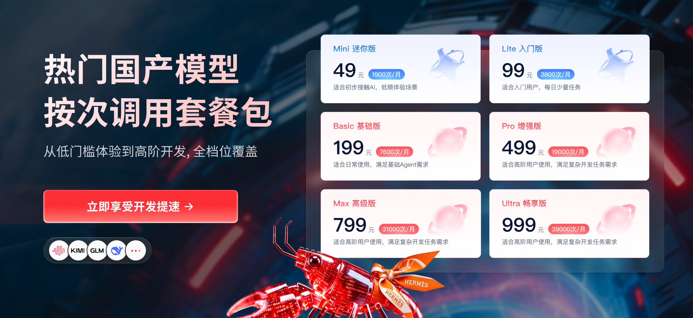

[![Read Frog banner][image-banner]][website]

  
  <a href="https://www.star-history.com/mengxi-ream/read-frog">
    <picture>
      <source media="(prefers-color-scheme: dark)" srcset="https://api.star-history.com/badge?repo=mengxi-ream/read-frog&theme=dark" />
      <source media="(prefers-color-scheme: light)" srcset="https://api.star-history.com/badge?repo=mengxi-ream/read-frog" />
      
    </picture>
  </a>

Una extensión de navegador open source para aprender idiomas con IA. 
Compatible con traducción inmersiva, análisis de artículos, múltiples modelos de IA y más. 
Domina idiomas con más facilidad y profundidad usando IA directamente en tu navegador.

[![English][english-shield]](../README.md) [![简体中文][chinese-shield]](./README.zh-CN.md) [![繁體中文][traditional-chinese-shield]](./README.zh-TW.md) [![日本語][japanese-shield]](./README.ja.md) [![한국어][korean-shield]](./README.ko.md) [![Español][spanish-shield]](./README.es.md) [![Русский][russian-shield]](./README.ru.md) [![Türkçe][turkish-shield]](./README.tr.md) [![Tiếng Việt][vietnamese-shield]](./README.vi.md)

[Sitio oficial](https://readfrog.app) · [Tutorial](https://www.readfrog.app/docs) · [Cambios][github-release-link] · [Blog](https://www.readfrog.app/blog)

<!-- SHIELD GROUP -->

[![Latest Version badge][extension-release-shield]][github-release-link]
[![Chrome Version badge][chrome-version-shield]][chrome-store-link]
[![Edge Version badge][edge-version-shield]][edge-store-link]
[![Firefox Version badge][firefox-version-shield]][firefox-store-link] 
[![Discord badge][discord-shield]][discord-link]
[![Chrome Users badge][chrome-users-shield]][chrome-store-link]
[![Edge Users badge][edge-users-shield]][edge-store-link]
[![Firefox Users badge][firefox-users-shield]][firefox-store-link] 
[![Stars badge][star-history-shield]][star-history-link]
[![Contributors badge][contributors-shield]][contributors-link]
![Last Commit badge][last-commit-shield]
[![Issues badge][issues-shield]][issues-link] 
[![Sponsor badge][sponsor-shield]][sponsor-link]

  
   
  注册<a href="https://readfrog.s.gy/RWqJeX">优云智算</a>：用最少的钱，换最高的编程效率。
    
  

<kbd>Tabla de contenidos</kbd>

#### Tabla de contenidos

- [📺 Demo](#-demo)
- [👋🏻 Primeros pasos y comunidad](#-primeros-pasos-y-comunidad)
  - [Descarga](#descarga)
  - [Comunidad](#comunidad)
- [✨ Funciones](#-funciones)
  - [🔄 Bilingüe / Solo traducción](#-bilingüe--solo-traducción)
  - [✨ Traducción de selección](#-traducción-de-selección)
  - [🧠 Traducción con contexto](#-traducción-con-contexto)
  - [🎬 Traducción de subtítulos](#-traducción-de-subtítulos)
  - [🔊 Texto a voz (TTS)](#-texto-a-voz-tts)
  - [📦 Solicitudes por lotes](#-solicitudes-por-lotes)
  - [🤖 Más de 20 proveedores de IA](#-más-de-20-proveedores-de-ia)
- [🤝 Contribuir](#-contribuir)
- [📜 Licencia comercial](#-licencia-comercial)
- [❤️ Patrocinadores](#️-patrocinadores)

 

## 📺 Demo

  
  

## 👋🏻 Primeros pasos y comunidad

La visión de Read Frog es ofrecer una experiencia de aprendizaje de idiomas fácil de usar, inteligente y personalizada para estudiantes de todos los niveles. En la era de la IA esto ya es posible, pero todavía hay pocos productos que cubran bien esta necesidad. Por eso decidimos construirlo nosotros mismos.

Tanto si eres usuario como desarrollador, Read Frog puede ser una parte importante de ese camino. El proyecto sigue en desarrollo activo y agradecemos cualquier comentario o [issue][issues-link].

### Descarga

| Navegador | Versión                                                                | Descarga                                                             |
| --------- | ---------------------------------------------------------------------- | -------------------------------------------------------------------- |
| Chrome    | [![Chrome Version badge][chrome-version-shield]][chrome-store-link]    | [Chrome Web Store][chrome-store-link] o [espejo chino][crxsoso-link] |
| Edge      | [![Edge Version badge][edge-version-shield]][edge-store-link]          | [Microsoft Edge Addons][edge-store-link]                             |
| Firefox   | [![Firefox Version badge][firefox-version-shield]][firefox-store-link] | [Firefox Add-ons][firefox-store-link]                                |

### Comunidad

| [![Discord badge][discord-shield-badge]][discord-link] | Haz preguntas y habla con desarrolladores en Discord.                    |
| :----------------------------------------------------- | :----------------------------------------------------------------------- |
| [![WeChat badge][wechat-shield-badge]][wechat-link]    | Si estás en China continental, también puedes unirte al grupo de WeChat. |

> \[!IMPORTANT]
>
> **⭐️ Danos una estrella** para recibir notificaciones de cada lanzamiento en GitHub sin retraso.

[![Star Read Frog on GitHub][image-star]][github-star-link]

  <kbd>Historial de estrellas</kbd>

<a href="https://www.star-history.com/#mengxi-ream/read-frog&Timeline">
 <picture>
   <source media="(prefers-color-scheme: dark)" srcset="https://api.star-history.com/svg?repos=mengxi-ream/read-frog&type=Timeline&theme=dark" />
   <source media="(prefers-color-scheme: light)" srcset="https://api.star-history.com/svg?repos=mengxi-ream/read-frog&type=Timeline" />
   
 </picture>
</a>

## ✨ Funciones

Convierte tu lectura diaria en la web en una experiencia inmersiva de aprendizaje de idiomas con Read Frog.

### 🔄 [Bilingüe / Solo traducción][docs-tutorial]

Cambia sin fricción entre dos modos de traducción. El **modo bilingüe** muestra el texto original junto a su traducción, ideal para aprender y comparar. El modo **solo traducción** reemplaza el texto original para una lectura más limpia.

Si cambias de modo mientras la traducción está activa, la extensión vuelve a traducir automáticamente todo el contenido visible sin recargar la página.

### ✨ [Traducción de selección][docs-tutorial]

Selecciona cualquier texto en una página para abrir una barra de herramientas inteligente. **Traducir** muestra el resultado en streaming, **Explicar** ofrece una explicación adaptada a tu nivel y **Leer** reproduce el texto con TTS.

La barra se coloca automáticamente dentro de la ventana, se puede arrastrar y funciona en cualquier sitio web.

### 🧠 [Traducción con contexto][docs-tutorial]

Permite que la IA entienda el contexto completo de lo que lees. Read Frog extrae el título de la página y una versión Markdown concisa del contenido para generar traducciones más precisas y adecuadas al contexto.

Así los términos técnicos se traducen correctamente, las expresiones literarias conservan matices y las frases ambiguas se interpretan según el contenido que las rodea.

### 🎬 [Traducción de subtítulos][docs-tutorial]

Traduce subtítulos de YouTube directamente en el reproductor. Puedes ver contenido en otros idiomas con la traducción junto al subtítulo original.

### 🔊 [Texto a voz (TTS)][docs-tutorial]

Escucha cualquier texto seleccionado con voces de IA de alta calidad. Funciona con **Edge TTS**, es completamente gratis y ofrece más de 150 voces en más de 80 idiomas. Puedes ajustar velocidad, tono y volumen.

La detección automática de idioma y el mapeo de voces por idioma ayudan a elegir la voz adecuada. El texto largo se divide en límites naturales y se precarga el siguiente fragmento para una reproducción fluida.

### 📦 [Solicitudes por lotes][docs-tutorial]

Ahorra hasta un 70% en costes de API con agrupación inteligente de solicitudes. Read Frog combina varias traducciones en una sola llamada, reduciendo overhead y uso de tokens sin sacrificar calidad.

Incluye reintentos con backoff exponencial y fallback automático a solicitudes individuales si falla el procesamiento por lotes.

### 🤖 [Más de 20 proveedores de IA][docs-tutorial]

Conecta con más de 20 proveedores mediante Vercel AI SDK: OpenAI, DeepSeek, Anthropic Claude, Google Gemini, xAI Grok, Groq, Mistral, Ollama y muchos más. Configura endpoints, API keys y modelos por proveedor.

También hay opciones gratuitas: Google Translate, Microsoft Translate y DeepLX para traducciones básicas sin coste.

[![Back to top][back-to-top]](#readme-top)

## 🤝 Contribuir

Toda contribución es bienvenida.

1. Recomienda Read Frog a tus amigos y familiares.
2. Reporta [issues][issues-link] y envía feedback.
3. Contribuye con código.

### Contribuir con código

Estructura del proyecto: [DeepWiki](https://deepwiki.com/mengxi-ream/read-frog)

Pide a la IA que entienda el proyecto: [Dosu](https://app.dosu.dev/29569286-71ba-47dd-b038-c7ab1b9d0df7/documents)

Consulta la [guía de contribución](https://readfrog.app/en/docs/code-contribution/contribution-guide) para más detalles.

ReadFrog tiene doble licencia: GPLv3 y licencia comercial.

Consulta [CONTRIBUTING.md](../CONTRIBUTING.md) para los términos de licencia de contribuyentes.

<a href="https://github.com/mengxi-ream/read-frog/graphs/contributors">
  <table>
    <tr>
      <th colspan="2">
         
         
         
      </th>
    </tr>
  </table>
</a>

## 📜 Licencia comercial

 **Meituan Tabbit Browser Team**: licencia gratuita para uso comercial de código cerrado, limitada a v1.21.3 y versiones anteriores (commit [`724863f`](https://github.com/mengxi-ream/read-frog/commit/724863fdbc2d777766cada6c111235534ee03ca0)). Concedida el 3 de marzo de 2026 a las 9:00 AM, hora de Vancouver (UTC-8).

## ❤️ Patrocinadores

Cada donación nos ayuda a crear una mejor experiencia de aprendizaje de idiomas. Gracias por apoyar nuestra misión.

[![Sponsors][sponsor-image]][sponsor-link]

[![Back to top][back-to-top]](#readme-top)

<!-- LINK GROUP -->

[back-to-top]: https://img.shields.io/badge/-BACK_TO_TOP-151515?style=flat-square
[chrome-store-link]: https://chromewebstore.google.com/detail/read-frog-open-source-ai/modkelfkcfjpgbfmnbnllalkiogfofhb
[chrome-users-shield]: https://img.shields.io/chrome-web-store/users/modkelfkcfjpgbfmnbnllalkiogfofhb?style=flat-square&label=Chrome%20Users&color=yellow&labelColor=black
[chrome-version-shield]: https://img.shields.io/chrome-web-store/v/modkelfkcfjpgbfmnbnllalkiogfofhb?style=flat-square&label=Chrome%20Version&labelColor=black&color=yellow
[contributors-link]: https://github.com/mengxi-ream/read-frog/graphs/contributors
[contributors-shield]: https://img.shields.io/github/contributors/mengxi-ream/read-frog?style=flat-square&labelColor=black
[crxsoso-link]: https://www.crxsoso.com/webstore/detail/modkelfkcfjpgbfmnbnllalkiogfofhb
[chinese-shield]: https://img.shields.io/badge/%E7%AE%80%E4%BD%93%E4%B8%AD%E6%96%87-gray?style=flat-square
[discord-link]: https://discord.gg/ej45e3PezJ
[discord-shield]: https://img.shields.io/discord/1371229720942874646?style=flat-square&label=Discord&logo=discord&logoColor=white&color=5865F2&labelColor=black
[discord-shield-badge]: https://img.shields.io/badge/chat-Discord-5865F2?style=for-the-badge&logo=discord&logoColor=white&labelColor=black
[edge-store-link]: https://microsoftedge.microsoft.com/addons/detail/read-frog-open-source-a/cbcbomlgikfbdnoaohcjfledcoklcjbo
[english-shield]: https://img.shields.io/badge/English-gray?style=flat-square
[firefox-store-link]: https://addons.mozilla.org/firefox/addon/read-frog-open-ai-translator/
[firefox-version-shield]: https://img.shields.io/amo/v/read-frog-open-ai-translator?style=flat-square&label=Firefox%20Version&labelColor=black&color=orange
[firefox-users-shield]: https://img.shields.io/amo/users/read-frog-open-ai-translator?style=flat-square&label=Firefox%20Users&color=orange&labelColor=black
[edge-users-shield]: https://img.shields.io/badge/dynamic/json?style=flat-square&logo=microsoft-edge&label=Edge%20Users&query=%24.activeInstallCount&url=https%3A%2F%2Fmicrosoftedge.microsoft.com%2Faddons%2Fgetproductdetailsbycrxid%2Fcbcbomlgikfbdnoaohcjfledcoklcjbo&labelColor=black
[edge-version-shield]: https://img.shields.io/badge/dynamic/json?style=flat-square&logo=microsoft-edge&label=Edge%20Version&query=%24.version&url=https%3A%2F%2Fmicrosoftedge.microsoft.com%2Faddons%2Fgetproductdetailsbycrxid%2Fcbcbomlgikfbdnoaohcjfledcoklcjbo&labelColor=black&prefix=v
[extension-release-shield]: https://img.shields.io/github/package-json/v/mengxi-ream/read-frog?filename=package.json&style=flat-square&label=Latest%20Version&color=brightgreen&labelColor=black
[github-release-link]: https://github.com/mengxi-ream/read-frog/releases
[github-star-link]: https://github.com/mengxi-ream/read-frog/stargazers
[image-banner]: ../assets/banner.png
[image-star]: ../assets/star.png
[issues-link]: https://github.com/mengxi-ream/read-frog/issues
[issues-shield]: https://img.shields.io/github/issues/mengxi-ream/read-frog?style=flat-square&labelColor=black
[japanese-shield]: https://img.shields.io/badge/%E6%97%A5%E6%9C%AC%E8%AA%9E-gray?style=flat-square
[korean-shield]: https://img.shields.io/badge/%ED%95%9C%EA%B5%AD%EC%96%B4-gray?style=flat-square
[last-commit-shield]: https://img.shields.io/github/last-commit/mengxi-ream/read-frog?style=flat-square&label=commit&labelColor=black
[russian-shield]: https://img.shields.io/badge/%D0%A0%D1%83%D1%81%D1%81%D0%BA%D0%B8%D0%B9-gray?style=flat-square
[sponsor-image]: https://cdn.jsdelivr.net/gh/mengxi-ream/static/sponsorkit/sponsors.svg
[sponsor-link]: https://github.com/sponsors/mengxi-ream
[sponsor-shield]: https://img.shields.io/github/sponsors/mengxi-ream?style=flat-square&label=Sponsor&color=EA4AAA&labelColor=black
[spanish-shield]: https://img.shields.io/badge/Espa%C3%B1ol-gray?style=flat-square
[star-history-link]: https://www.star-history.com/#mengxi-ream/read-frog&Timeline
[star-history-shield]: https://img.shields.io/github/stars/mengxi-ream/read-frog?style=flat-square&label=stars&color=yellow&labelColor=black
[traditional-chinese-shield]: https://img.shields.io/badge/%E7%B9%81%E9%AB%94%E4%B8%AD%E6%96%87-gray?style=flat-square
[turkish-shield]: https://img.shields.io/badge/T%C3%BCrk%C3%A7e-gray?style=flat-square
[vietnamese-shield]: https://img.shields.io/badge/Ti%E1%BA%BFng%20Vi%E1%BB%87t-gray?style=flat-square
[website]: https://readfrog.app
[wechat-link]: ../assets/wechat-account.jpg
[wechat-shield-badge]: https://img.shields.io/badge/chat-WeChat-07C160?style=for-the-badge&logo=wechat&logoColor=white&labelColor=black

<!-- Feature docs link -->

[docs-tutorial]: https://readfrog.app/docs
